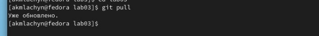

**                  

`                        `**ОТЧЕТ**

**ПО ЛАБОРАТОРНОЙ РАБОТЕ №3**

Дисциплина: Архитектура компьютеров

**Цель работы :** Целью работы является освоение процедуры оформления отчетов с помощью легковесного языка разметки Markdown.

`                            `Студенка: Акыммаева Лачын Максатовна 

`                                                             `Группа: НБИ-04.22

**Цель работы :** Целью работы является освоение процедуры оформления отчетов с помощью легковесного языка разметки Markdown.

**Ход работы:**

1)Перейдём в каталог с шаблоном отчёта по лабораторной работе №3:

cd ~/work/study/"Архитектура компьютера"/study\_2022-2023\_arh-pc

cd labs 

cd lab03 

`    `2)Обновляю локальный репозиторий, скачав изменения командой (git pull).

`    `3)Переходим в папку report.

` `cd report 

`     `4)Проведём компиляцию шаблона используя “Makefile”, командой make.

`   `5) Удалю получившиеся файлы (report.pdf и report.docx) используя make clean.

`      `6) Открываю файл report.md, командой gedit, (открывается текстовой редактор gedit ).

`   `7) Заполняю отчёт о выполнении работы и скомпилирую его с помощью Makefile. Перемещаю скриншоты работы в подкаталог image.

\8) Загружаю все изменения в репозиторий Github

**Вывод:** узнала об Markdown. Приобрела практические навыки в работе с разметкой-Markdown 
