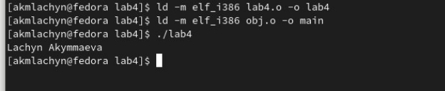

ÎÒ×ÅÒ

ÏÎ ËÀÁÎÐÀÒÎÐÍÎÉ ÐÀÁÎÒÅ ¹4

Äèñöèïëèíà : Àðõèòåêòóðà êîìïüþòåðà

Öåëü ðàáîòû: Îñâîåíèå ïðîöåäóðû êîìïèëÿöèè è ñáîðêè ïðîãðàìì, íàïèñàííûõ íà àññåìáëåðå NASM

`            `Ñòóäåíêà: Àêûììàåâà Ëà÷ûí Ìàêñàòîâíà 

`                                                    `Ãðóïïà: ÍÁÈ-04.22 

Ìîñêâà-2022ã.

**Öåëü ðàáîòû:** Îñâîåíèå ïðîöåäóðû êîìïèëÿöèè è ñáîðêè ïðîãðàìì, íàïèñàííûõ íà àññåìáëåðå NASM

` `**Õîä ðàáîòû**

\1. Â êàòàëîãå **~/work/arch-pc/lab05** ñ ïîìîùüþ êîìàíäû **cp** ñîçäàëà êîïèþ ôàéëà hello.asm ñ èìåíåì lab5.asm 

\2. Ñ ïîìîùüþ  òåêñòîâîãî ðåäàêòîðà âíåñëà èçìåíåíèÿ â òåêñò ïðîãðàììû â ôàéëå lab5.asm òàê, ÷òîáû âìåñòî Hello world! Ââîäèì Lachyn Akymmaev.

\3. Îòòðàíñëèðóåì ïîëó÷åííûé òåêñò ïðîãðàììû lab5.asm â îáúåêòíîì ôàéëå. Âûïîëíèì êîìïîíîâêó îáúåêòíîãî ôàéëà è çàïóñòèòåì ïîëó÷èâøèéñÿ èñïîëíÿåìûé ôàéë. 

\4. Ñêîïèðóéòå ôàéëû hello.asm è lab5.asm â ëîêàëüíûé ðåïîçèòîðèé â êàòàëîã ~/work/study/2022-2023/"Àðõèòåêòóðà êîìïüþòåðà"/archpc/labs  

` `Çàãðóçèëà ôàéëû â ãèäõàá 

`	`Âûâîä: èçó÷èëè ïðîöåäóðû êîìïèëÿöèè è ñáîðêè ïðîãðàìì, íàïèñàííûõ íà àññåìáëåðå NASM.
