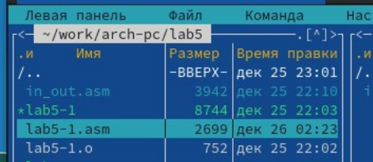
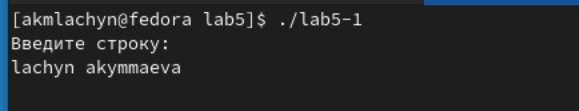



**ОТЧЁТ**

**ПО ЛАБОРАТОРНОЙ РАБОТЕ №5**

Дисциплина : Архитектура компьютера

**Цель работы**: Приобретение практических навыков работы в Midnight Commander. Освоение инструкций языка ассемблера mov и int.

`            `Студенка: Акыммаева Лачын Максатовна 

`                                                    `Группа: НБИ-04.22 

`	`Москва-2022г.	

**Цель работы**: Приобретение практических навыков работы в Midnight Commander. Освоение инструкций языка ассемблера mov и int.

**Ход работы**

1. Создала копию файла lab6-1.asm. Внеся изменения в программ, так чтобы она работала по следующему алгоритму: 

• вывести приглашение типа “Введите строку:”; 

• ввести строку с клавиатуры; 

• вывести введённую строку на экран.

1. Полученный файл проверяем его работу. На приглашение ввыведенную строку вводим свою фамилию имя . 

 

\3. 

3.Создаём копию файла lab6-2.asm. Исправляя  текст программы с использование подпрограмм из внешнего файла in\_out.asm, так чтобы она работала по следующему алгоритму: 

• вывести приглашение типа “Введите  строку:”; 

• ввести строку с клавиатуры; 

• вывести введённую строку на экран.

**Вывод** Приобрели практический навык в работе в Midnight Commander. Освоением инструкции языка ассемблера mov и int.

