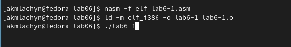
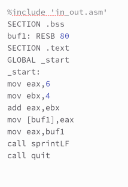
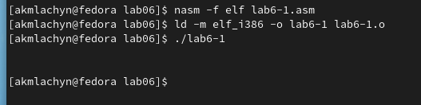
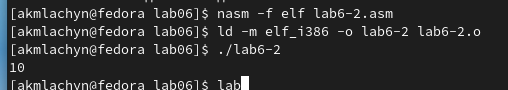
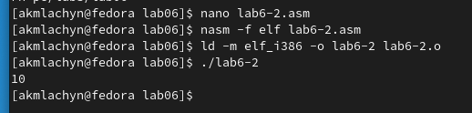



**ОТЧЕТ**

**ПО ЛАБОРАТОРНОЙ РАБОТЕ №6**

Дисциплина: Архитектура компьютера

**Цель работы:** Освоение арифметических инструкций языка ассемблера NASM.

`            `Студенка: Акыммаева Лачын Максатовна 

`                                                    `Группа: НБИ-04.22 

Москва-2022г.

**Цель работы:** Освоение арифметических инструкций языка ассемблера NASM.

**Ход работы** 

**1)***Создаю каталог* **lab6** *расположенного в* **arch-pc** *и*

**2)***Изменяю содержимое кода файла:*

**3)***Подключу к нему файл* **in\_out.asm** *взятым из ТУИСа:*

**4)***И запущу программу:*

**5)** *Убираю апостроффы у значений:6 и 4:*

**6)** *Убедившись ,что файл имеет наличие кода, проведу трансляцию и компоновку и запущу его:*

**7)** *Создам файл* **lab6-2.asm** *и изменю его код на код из листинга 7.2 ,скомпоновав воспроизведу его*

**8)** *Удалю апострофы в файле* **lab6-2.asm:*** 

**9)** *Создаю файл* **lab6-3.asm:**

__10*)*__ *Редактирую содержимое* __lab6-3.asm:__

**11)***Запускаю* **lab6-3.asm:**

**12)** *Меняю код* **lab6-3.asm** *под пример𝑓(𝑥) = (4 ∗ 6 +2)/5:*

**13)***Вывод* **lab6-3.asm:**

**14)***Создаю файл* **variant.asm** *и ввожу код из листинга 7.4 и воспроизведу его через терминал:*

**                                                                                             

`	`Ответы на вопросы:

` `1. mov eax и rem call sprint;

` `2. mov ecx,x - запись входной переменной в регистр ecx; mov edx, 80 - запись размера переменной в регистр edx; call sread - вызов процедуры чтения данных;

` `3. call atoi - функция преобразующая ASCII код символа в целое число и записывающая результат в регистр eax;

` `4. xor edx, edx mov ebx, 20 div ebx, inc edx;

` `5. div ebx - ebx;

` `6. inc - используется для увеличения операнда на единицу;

` `7. mov eax, rem call sprint mov eax, edx call iprintLF.

**САМОСТОЯТЕЛЬНАЯ РАБОТА:**

**1)***Создам файл* **lab6-4.asm** *для выполнения самостоятельной работы и напишу код чтобы программа правильно подсчитала пример (8𝑥 − 6)/2 и введу два значения из таблицы:*

**ВЫВОД :**

В ходе выполнения данной лабораторной работы. Получили практические навыки в работе с арифметическом языком ассамблея  NASM. 

